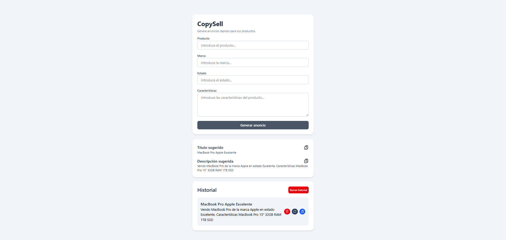

# CopyShell
Generador de anuncios de productos desarrollado con React. Permite crear anuncios rápidamente a partir de un formulario y guardar un historial de anuncios generados.

## Demo

Live demo: https://copysell.vercel.app

## Funcionalidades

- Generación automática de anuncios a partir de un formulario
- Validación de campos obligatorios
- Inputs controlados con React
- Copiar título o descripción al portapapeles
- Historial de anuncios generados
- Persistencia del historial usando localStorage
- Eliminación de anuncios individuales
- Eliminación completa del historial
- Reutilización de anuncios desde el historial
- Identificación de anuncios medante IDs únicos
- Feedback visual al copiar contenido

## Tecnologías

- React
- Vite
- TailwindCSS
- JavaScript
- localStorage API

## Qué aprendí

Durante el desarrollo de este proyecto practiqué:

- Manejo de estado con React (`useState`)
- Persistencia de datos en el navegador usando `localStorage`
- Uso de `useEffect` para sincronizar estado y almacenamiento
- Creación de componentes reutilizables
- Gestión de listas con `map` y `key`
- Generación de identificadores únicos para cada elemento
- Validación de formularios
- Mejora de la experiencia de usuario con feedback visual

## Mejoras futuras

- Añadir edición de anuncios desde el historial
- Permitir exportar anuncios
- Añadir filtros o búsqueda en el historial
- Añadir modo oscuro
- Conectar la aplicación a un backend para guardar anuncios en base de datos

## Instalación

Clonar el repositorio:

git clone https://github.com/HugoSalaDev/copysell

Entrar en el proyecto:

cd copysell

Instalar dependencias:

npm install

Iniciar servidor de desarrollo:

npm run dev

## Estructura del proyecto

src/
  components/
    ProductForm.jsx
    ResultCard.jsx
    HistoryList.jsx
  App.jsx
  main.jsx
